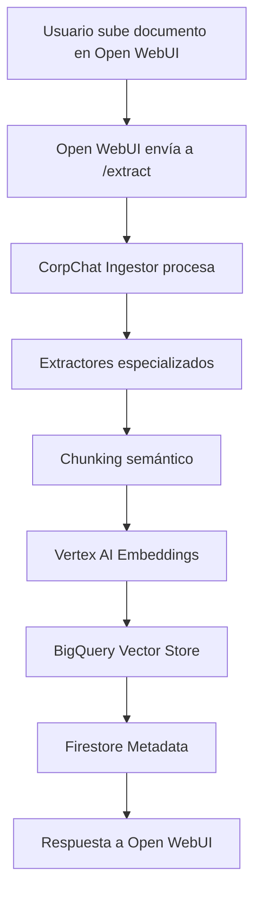
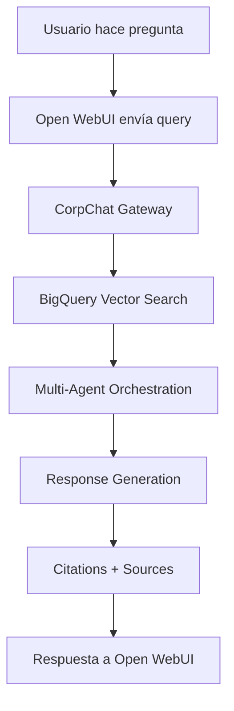

# Guía de Integración: Open WebUI + CorpChat Pipeline

**Fecha**: 16 Octubre 2025  
**Objetivo**: Configurar Open WebUI para usar CorpChat Pipeline como backend de procesamiento de documentos.

---

## 🎯 **CONFIGURACIÓN EN OPEN WEBUI ADMIN PANEL**

### **1. Admin Panel > Settings > Documents**

#### **General Section:**
```yaml
Content Extraction Engine: "Custom CorpChat"
Custom Extraction URL: "https://corpchat-ingestor-2s63drefva-uc.a.run.app/extract"
Custom API Key: "corpchat-ingestor"

PDF Extract Images (OCR): ✅ ON
Bypass Embedding and Retrieval: ❌ OFF
Text Splitter: "Semantic (CorpChat)"
Chunk Size: "1000"
Chunk Overlap: "100"
```

#### **Embedding Section:**
```yaml
Embedding Model Engine: "Vertex AI (CorpChat)"
Embedding Model: "text-embedding-004"
Custom Embedding URL: "https://corpchat-ingestor-2s63drefva-uc.a.run.app/embeddings"
```

#### **Retrieval Section:**
```yaml
Full Context Mode: ❌ OFF
Hybrid Search: ✅ ON
Top K: "3"
Vector Store: "BigQuery Enterprise"
```

#### **Files Section:**
```yaml
Allowed File Extensions: "pdf, docx, xlsx, txt, png, jpg, jpeg"
Max Upload Size: "100MB"
Max Upload Count: "10"
Image Compression Width: "1920"
Image Compression Height: "1080"
```

### **2. Admin Panel > Settings > Connections**

#### **CorpChat Pipeline Connection:**
```yaml
Connection Name: "CorpChat Pipeline"
URL: "https://corpchat-ingestor-2s63drefva-uc.a.run.app"
API Key: "corpchat-ingestor"
Provider Type: "Custom Document Processing"
```

#### **CorpChat Gateway Connection:**
```yaml
Connection Name: "CorpChat Gateway"
URL: "https://corpchat-gateway-2s63drefva-uc.a.run.app"
API Key: "corpchat-gateway"
Provider Type: "OpenAI Compatible"
```

---

## 🔧 **ENDPOINTS IMPLEMENTADOS EN CORPCHAT**

### **1. Document Processing Endpoint:**
```http
POST /extract
Content-Type: multipart/form-data

Parameters:
- file: UploadFile (required)
- user_id: str (default: "openwebui_user")
- chunk_size: int (default: 1000)
- chunk_overlap: int (default: 100)
- top_k: int (default: 3)
- hybrid_search: bool (default: True)
- bypass_embedding: bool (default: False)
```

**Response:**
```json
{
  "success": true,
  "content": "extracted text content",
  "chunks": 5,
  "metadata": {
    "filename": "document.pdf",
    "size": 1024000,
    "chunk_size": 1000,
    "chunk_overlap": 100,
    "embeddings_ready": true
  },
  "citations": [...],
  "vector_store": "bigquery"
}
```

### **2. Admin Endpoints (Danger Zone):**

#### **Reset Upload Directory:**
```http
POST /admin/reset-upload-directory
```

#### **Reset Vector Storage:**
```http
POST /admin/reset-vector-storage
```

#### **Reindex Knowledge Base:**
```http
POST /admin/reindex-knowledge-base
```

---

## 📋 **MAPEO DE PARÁMETROS**

### **Open WebUI → CorpChat Pipeline:**

| Open WebUI Parameter | CorpChat Mapping | Description |
|---------------------|------------------|-------------|
| `chunk_size` | `chunk_size` | Tamaño de chunks (1000 → 512 por defecto) |
| `chunk_overlap` | `chunk_overlap` | Solapamiento entre chunks (100 → 128 por defecto) |
| `top_k` | `limit` | Número de resultados a retornar |
| `hybrid_search` | `hybrid_search` | Búsqueda híbrida (semantic + BM25) |
| `bypass_embedding` | `skip_embeddings` | Saltar generación de embeddings |
| `pdf_extract_images` | `ocr_enabled` | Extraer texto de imágenes en PDFs |
| `allowed_extensions` | `supported_formats` | Formatos de archivo soportados |

### **Configuración Automática:**

```python
# Mapeo automático en openwebui_integration.py
openwebui_config = OpenWebUIConfig(
    chunk_size=1000,           # Open WebUI
    chunk_overlap=100,         # Open WebUI
    top_k=3,                   # Open WebUI
    hybrid_search=True,        # Open WebUI
    bypass_embedding=False     # Open WebUI
)

corpchat_config = map_openwebui_to_corpchat(openwebui_config)
# Resultado: configuración optimizada para CorpChat Pipeline
```

---

## 🚀 **FLUJO DE TRABAJO**

### **1. Upload de Documento:**


### **2. RAG Query:**


---

## ⚙️ **CONFIGURACIÓN TÉCNICA**

### **Variables de Entorno para Open WebUI:**

```yaml
# services/ui/env-vars.yaml
# Configuración CorpChat Integration
CORPCHAT_INGESTOR_URL: "https://corpchat-ingestor-2s63drefva-uc.a.run.app"
CORPCHAT_INGESTOR_API_KEY: "corpchat-ingestor"
CORPCHAT_GATEWAY_URL: "https://corpchat-gateway-2s63drefva-uc.a.run.app"
CORPCHAT_GATEWAY_API_KEY: "corpchat-gateway"

# Document Processing
DEFAULT_CHUNK_SIZE: "1000"
DEFAULT_CHUNK_OVERLAP: "100"
DEFAULT_TOP_K: "3"
ENABLE_HYBRID_SEARCH: "true"

# File Upload
MAX_UPLOAD_SIZE: "104857600"  # 100MB
MAX_UPLOAD_COUNT: "10"
ALLOWED_EXTENSIONS: "pdf,docx,xlsx,txt,png,jpg,jpeg"

# Image Processing
IMAGE_COMPRESSION_WIDTH: "1920"
IMAGE_COMPRESSION_HEIGHT: "1080"
```

### **Configuración de BigQuery:**

```sql
-- Dataset: corpchat
-- Table: embeddings
CREATE TABLE `genai-385616.corpchat.embeddings` (
  embedding_id STRING,
  attachment_id STRING,
  chat_id STRING,
  user_id STRING,
  text STRING,
  embedding ARRAY<FLOAT64>,
  metadata JSON,
  created_at TIMESTAMP,
  updated_at TIMESTAMP
)
PARTITION BY DATE(created_at)
CLUSTER BY user_id, chat_id;
```

---

## 🧪 **TESTING Y VALIDACIÓN**

### **1. Test de Upload:**
```bash
curl -X POST "https://corpchat-ingestor-2s63drefva-uc.a.run.app/extract" \
  -H "Content-Type: multipart/form-data" \
  -F "file=@test_document.pdf" \
  -F "chunk_size=1000" \
  -F "chunk_overlap=100" \
  -F "top_k=3"
```

### **2. Test de RAG:**
```bash
curl -X POST "https://corpchat-gateway-2s63drefva-uc.a.run.app/v1/rag/search" \
  -H "Content-Type: application/json" \
  -d '{
    "query": "What is the main topic?",
    "user_id": "test_user",
    "limit": 3
  }'
```

### **3. Test de Admin Functions:**
```bash
# Reset Vector Storage
curl -X POST "https://corpchat-ingestor-2s63drefva-uc.a.run.app/admin/reset-vector-storage"

# Reindex Knowledge Base
curl -X POST "https://corpchat-ingestor-2s63drefva-uc.a.run.app/admin/reindex-knowledge-base"
```

---

## 📊 **MONITOREO Y LOGS**

### **Cloud Logging Queries:**
```sql
-- Logs del Ingestor
resource.type="cloud_run_revision"
resource.labels.service_name="corpchat-ingestor"
textPayload:"Open WebUI extraction"

-- Logs del Gateway
resource.type="cloud_run_revision"
resource.labels.service_name="corpchat-gateway"
textPayload:"RAG search"
```

### **Métricas Clave:**
- **Upload Success Rate**: % de documentos procesados exitosamente
- **Processing Time**: Tiempo promedio de procesamiento
- **Chunk Generation**: Número de chunks generados por documento
- **Embedding Generation**: Tiempo de generación de embeddings
- **Vector Search Performance**: Latencia de búsquedas

---

## 🎯 **BENEFICIOS DE LA INTEGRACIÓN**

### **Para Usuarios:**
- ✅ **Interfaz familiar** (Open WebUI)
- ✅ **Upload directo** de documentos
- ✅ **RAG transparente** con citations
- ✅ **Configuración flexible** desde admin panel

### **Para Administradores:**
- ✅ **Escalabilidad empresarial** (BigQuery + Cloud Storage)
- ✅ **Analytics avanzados** (Cloud Monitoring)
- ✅ **Multi-tenant** support
- ✅ **Cost optimization** (Cloud Run auto-scaling)

### **Para Desarrolladores:**
- ✅ **APIs unificadas** (OpenAI compatible)
- ✅ **Pipeline robusto** (CorpChat backend)
- ✅ **Monitoring integrado**
- ✅ **CI/CD automatizado**

---

## 🚨 **CONSIDERACIONES IMPORTANTES**

### **Seguridad:**
- ✅ **API Keys** protegidas en Cloud Secret Manager
- ✅ **IAM roles** configurados correctamente
- ✅ **CORS** configurado para Open WebUI
- ✅ **Rate limiting** implementado

### **Performance:**
- ✅ **Auto-scaling** Cloud Run (0-10 instances)
- ✅ **Caching** de embeddings en BigQuery
- ✅ **Batch processing** para documentos grandes
- ✅ **Async processing** para mejor throughput

### **Costos:**
- ✅ **Pay-per-use** Cloud Run
- ✅ **BigQuery** solo paga por queries
- ✅ **Cloud Storage** lifecycle policies
- ✅ **Monitoring** de costos con budgets

---

**Estado**: ✅ **Implementado y Listo para Testing**  
**Próximo Paso**: Deploy y testing E2E de la integración completa
