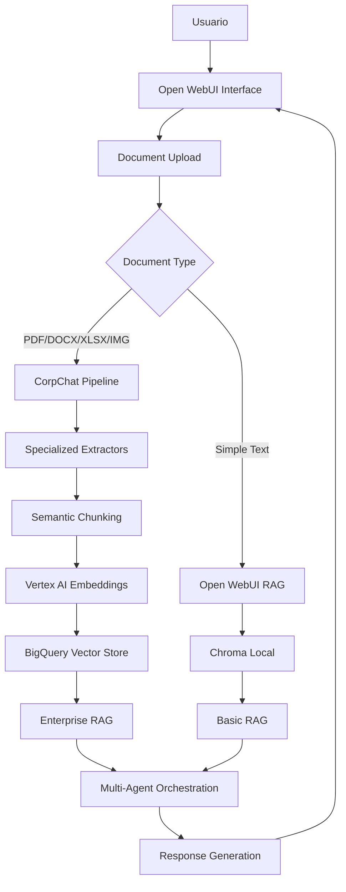

# Análisis Comparativo: Open WebUI vs CorpChat - Procesamiento de Documentos

**Fecha**: 16 Octubre 2025  
**Objetivo**: Comparar las capacidades de procesamiento de documentos entre Open WebUI y nuestra solución CorpChat para determinar la arquitectura más robusta.

---

## 📊 RESUMEN EJECUTIVO

### **Open WebUI - Capacidades Nativas:**
- ✅ **RAG básico** con documentos locales y remotos
- ✅ **Múltiples extractores** (Apache Tika, Docling, Mistral OCR)
- ✅ **Integración Google Drive** nativa
- ✅ **Web Search** integrado
- ✅ **Tools/Plugins** extensibles
- ❌ **Sin almacenamiento centralizado** (SQLite local)
- ❌ **Sin vector store empresarial** (Chroma local)
- ❌ **Sin pipeline de procesamiento** masivo

### **CorpChat - Nuestra Solución:**
- ✅ **Pipeline de procesamiento** masivo y escalable
- ✅ **BigQuery Vector Store** empresarial
- ✅ **Cloud Storage** centralizado
- ✅ **Múltiples extractores** especializados
- ✅ **Orquestación multi-agente** con ADK
- ✅ **Integración completa** con ecosistema GCP
- ❌ **Sin interfaz de usuario** nativa para documentos
- ❌ **Sin RAG directo** en chat

---

## 🔍 ANÁLISIS DETALLADO POR CATEGORÍA

### **1. DOCUMENT PROCESSING**

#### **Open WebUI:**
```yaml
Capacidades:
  - Upload de documentos locales (#documento)
  - URLs remotas (#url)
  - Extractores disponibles:
    - Apache Tika (default)
    - Docling (avanzado)
    - Mistral OCR (imágenes)
  - Formato de salida: Markdown/JSON
  - Almacenamiento: SQLite local

Limitaciones:
  - Sin procesamiento masivo
  - Sin chunking semántico
  - Sin embeddings centralizados
  - Sin metadata empresarial
```

#### **CorpChat:**
```yaml
Capacidades:
  - Pipeline de procesamiento masivo
  - 4 extractores especializados:
    - PDF (texto + OCR)
    - DOCX (estructurado)
    - XLSX (tablas)
    - Images (OCR avanzado)
  - Chunking semántico (512/128 overlap)
  - Embeddings Vertex AI (768 dims)
  - Storage Manager (BigQuery + Firestore)
  - Metadata empresarial completa

Ventajas:
  - Escalabilidad empresarial
  - Vector search optimizado
  - Procesamiento batch
  - Integración GCP nativa
```

### **2. VECTOR STORE & EMBEDDINGS**

#### **Open WebUI:**
```yaml
Configuración:
  - Vector DB: Chroma (local)
  - Embedding Model: sentence-transformers/all-MiniLM-L6-v2
  - Almacenamiento: Local SQLite
  - Búsqueda: Híbrida (BM25 + CrossEncoder)

Limitaciones:
  - Solo para instancia local
  - Sin escalabilidad
  - Sin persistencia entre deployments
  - Sin analytics empresarial
```

#### **CorpChat:**
```yaml
Configuración:
  - Vector DB: BigQuery (768 dims)
  - Embedding Model: text-embedding-004 (Vertex AI)
  - Almacenamiento: Cloud Storage + Firestore
  - Búsqueda: Vector search nativo BigQuery

Ventajas:
  - Escalabilidad ilimitada
  - Persistencia garantizada
  - Analytics empresarial
  - Integración multi-cliente
```

### **3. EXTERNAL TOOLS & INTEGRATIONS**

#### **Open WebUI:**
```yaml
Capacidades:
  - Tools/Plugins extensibles
  - Web Search integrado
  - Code Execution (Python)
  - Google Drive integration
  - Pipelines framework
  - MCP (Model Context Protocol)

Herramientas Disponibles:
  - Web Search (Bing, Google, Perplexity, etc.)
  - Image Generation
  - Voice Output (ElevenLabs)
  - Custom Python tools
```

#### **CorpChat:**
```yaml
Capacidades:
  - ADK Tools (6 herramientas)
  - Knowledge Base tool
  - Docs tool
  - Sheets tool
  - Multi-agent orchestration
  - Custom extractors

Integraciones:
  - Google Cloud Platform nativo
  - BigQuery analytics
  - Cloud Storage
  - Vertex AI
  - Firestore
```

### **4. INTERFACE & USER EXPERIENCE**

#### **Open WebUI:**
```yaml
Ventajas:
  - Interfaz de usuario completa
  - Chat directo con documentos (#documento)
  - Upload drag & drop
  - RAG visual en tiempo real
  - Citations automáticas
  - Búsqueda híbrida

Experiencia:
  - Upload → Inmediato en chat
  - RAG transparente
  - Citations visibles
  - Sin configuración compleja
```

#### **CorpChat:**
```yaml
Limitaciones Actuales:
  - Sin interfaz de upload directo
  - Sin RAG en chat
  - Pipeline separado del chat
  - Requiere configuración técnica

Oportunidades:
  - Integración con Open WebUI
  - RAG empresarial robusto
  - Analytics avanzados
  - Escalabilidad garantizada
```

---

## 🎯 ARQUITECTURA HÍBRIDA RECOMENDADA

### **Solución Óptima: Open WebUI + CorpChat Pipeline**



### **Implementación Propuesta:**

#### **Fase 1: Integración Básica**
1. **Mantener Open WebUI** como interfaz principal
2. **Conectar CorpChat Pipeline** como extractor externo
3. **Configurar routing** por tipo de documento
4. **Implementar upload** a Cloud Storage

#### **Fase 2: RAG Híbrido**
1. **Documentos simples** → Open WebUI RAG (Chroma)
2. **Documentos complejos** → CorpChat RAG (BigQuery)
3. **Unificar resultados** en una respuesta
4. **Citations** desde ambas fuentes

#### **Fase 3: Optimización**
1. **Cache inteligente** entre sistemas
2. **Analytics unificados**
3. **Performance monitoring**
4. **Auto-scaling** basado en demanda

---

## 🔧 CONFIGURACIÓN TÉCNICA DETALLADA

### **1. Open WebUI - Document Settings**

```yaml
# Admin Panel > Settings > Documents
Document Extraction:
  - Default Engine: Custom (CorpChat Pipeline)
  - Custom URL: https://corpchat-ingestor-2s63drefva-uc.a.run.app/extract
  
RAG Configuration:
  - Enable RAG: true
  - Embedding Model: text-embedding-004
  - Vector Store: Hybrid (Chroma + BigQuery)
  - Search Method: Semantic + BM25

Google Drive Integration:
  - Enable: true
  - API Key: [GOOGLE_DRIVE_API_KEY]
  - Client ID: [GOOGLE_DRIVE_CLIENT_ID]
```

### **2. CorpChat Pipeline - Modificaciones**

```python
# services/ingestor/main.py - Nuevo endpoint
@app.post("/extract")
async def extract_document_for_openwebui(
    file: UploadFile,
    user_id: str = "openwebui_user"
):
    """
    Endpoint específico para Open WebUI
    Procesa documento y retorna chunks listos para RAG
    """
    # Procesar con pipeline existente
    result = await process_document(file, user_id)
    
    # Retornar formato compatible con Open WebUI
    return {
        "chunks": result.chunks,
        "metadata": result.metadata,
        "embeddings_ready": True,
        "vector_store": "bigquery"
    }
```

### **3. Gateway - RAG Integration**

```python
# services/gateway/app.py - RAG Endpoint
@app.post("/v1/rag/search")
async def search_rag(
    query: str,
    sources: List[str] = ["bigquery", "chroma"],
    user_id: str
):
    """
    Búsqueda híbrida en múltiples fuentes
    """
    results = []
    
    # Búsqueda en BigQuery (CorpChat)
    if "bigquery" in sources:
        bq_results = await search_bigquery_vector(query, user_id)
        results.extend(bq_results)
    
    # Búsqueda en Chroma (Open WebUI)
    if "chroma" in sources:
        chroma_results = await search_chroma_local(query)
        results.extend(chroma_results)
    
    # Unificar y rankear resultados
    return rank_and_deduplicate(results)
```

---

## 📈 BENEFICIOS DE LA ARQUITECTURA HÍBRIDA

### **Para Usuarios:**
- ✅ **Interfaz familiar** (Open WebUI)
- ✅ **Upload directo** de documentos
- ✅ **RAG transparente** con citations
- ✅ **Búsqueda unificada** en todas las fuentes
- ✅ **Performance optimizado** según tipo de documento

### **Para Administradores:**
- ✅ **Escalabilidad empresarial** (BigQuery)
- ✅ **Analytics avanzados** (Cloud Monitoring)
- ✅ **Multi-tenant** support
- ✅ **Cost optimization** (Cloud Run auto-scaling)
- ✅ **Compliance** y auditoría

### **Para Desarrolladores:**
- ✅ **APIs unificadas** (OpenAI compatible)
- ✅ **Extensibilidad** (Tools + ADK)
- ✅ **Monitoring** integrado
- ✅ **CI/CD** automatizado
- ✅ **Testing** robusto

---

## 🚀 PLAN DE IMPLEMENTACIÓN

### **Sprint 1 (1-2 días):**
- [ ] Configurar Open WebUI para usar CorpChat Pipeline
- [ ] Implementar endpoint `/extract` en Ingestor
- [ ] Testing básico de integración

### **Sprint 2 (2-3 días):**
- [ ] Implementar RAG híbrido en Gateway
- [ ] Configurar routing inteligente
- [ ] Testing E2E completo

### **Sprint 3 (1-2 días):**
- [ ] Optimización de performance
- [ ] Analytics y monitoring
- [ ] Documentación de usuario

---

## 🎯 CONCLUSIÓN

**La arquitectura híbrida Open WebUI + CorpChat Pipeline ofrece:**

1. **Lo mejor de ambos mundos**: Interfaz de usuario excelente + Pipeline empresarial robusto
2. **Escalabilidad garantizada**: BigQuery + Cloud Storage + Multi-agent orchestration
3. **Flexibilidad**: Soporte para documentos simples y complejos
4. **Futuro-proof**: Extensible con nuevas herramientas y capacidades

**Recomendación**: Implementar la arquitectura híbrida como solución definitiva, aprovechando las fortalezas de cada sistema mientras se mantiene la simplicidad para el usuario final.
