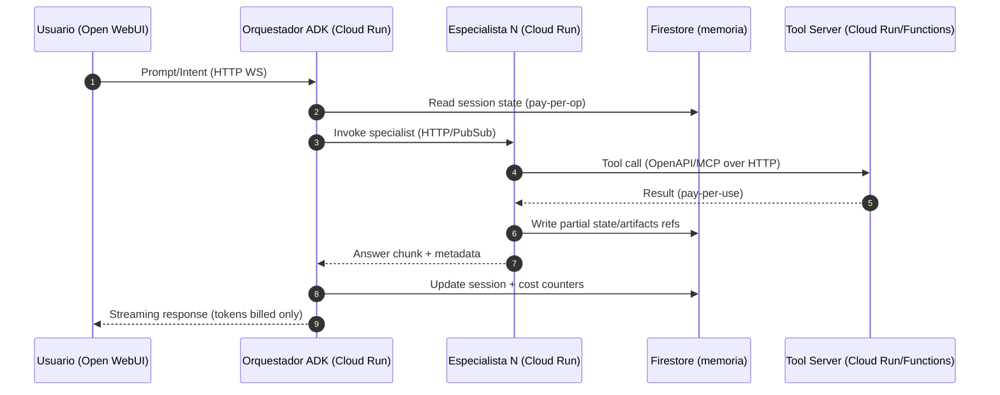

# Plataforma Conversacional – Arquitectura Serverless alineada a Pay‑per‑Use y FinOps (costo base = 0)

Este documento reestructura la plataforma conversacional (ADK + Open WebUI sobre GCP) para operar **sin costos en reposo**, con **guardrails de presupuesto** y **apagados automáticos**. Incluye: principios, arquitectura objetivo, orquestación de especialistas, plan de entornos, despliegue y automatizaciones de costo.

---
## 1) Principios FinOps (aplicables desde hoy)
- **Cero baseline**: Todos los componentes deben escalar a **0** sin tráfico. Evitar SKUs con instancias reservadas.
- **Pay‑per‑use estricto**: Preferir APIs por consumo (Vertex AI Generative, Cloud Run, Cloud Functions, Firestore, Cloud Storage, Pub/Sub).
- **Budget guardrails (duros y blandos)**:
  - Budgets + alertas (thresholds 50/80/100% por proyecto/entorno/etiqueta).
  - **Quotas** por servicio (Vertex AI tokens/calls, Cloud Run CPU, Pub/Sub ops) para frenar picos.
  - **Bloqueo automático** al superar umbrales: orquestaciones que deshabilitan rutas y escalan a 0 (Cloud Scheduler + Cloud Functions/Eventarc).
- **Apagados programados**: Entornos **dev/stage** apagan noches/fines de semana (Scheduler → scale-to-zero).
- **Cost tagging**: Labels/Tags por *team*, *entorno*, *servicio*, *cliente*; BigQuery export de billing + dashboards.
- **Observabilidad de costo**: Tablero único (Cloud Monitoring + BigQuery Billing Export + Looker Studio) y alerts por *spend rate*.
- **Monolitos de costo mínimos**: Prohibido GKE/GCE salvo requerimiento; todo en **Cloud Run/Functions**.

---
## 2) Arquitectura objetivo (alto nivel)

```mermaid
flowchart LR
  U[Usuarios (SSO/IAP)] --> LB{Cloud Load Balancer}
  LB --> OWUI[Open WebUI (Cloud Run, min_instances=0)]
  OWUI -- HTTP/WebSocket --> ORCH[Orquestador ADK (Cloud Run, 0->N)]
  ORCH -- Pub/Sub/Eventarc --> SPA[Agentes Especialistas ADK (Cloud Run, 0->N)]
  ORCH -- HTTPS/OpenAPI --> TOOLS[Tool Servers (Cloud Run/Functions, 0->N)]
  OWUI -- OpenAPI/MCP --> TOOLS
  subgraph Datos Serverless
    MEM[(Firestore (serverless))]
    CFG[(Secret Manager)]
    GCS[(Cloud Storage)]
    BQ[(BigQuery)]
  end
  ORCH <--/--> MEM
  SPA <--/--> MEM
  SPA -->|Grounding| BQ
  SPA -->|Artifacts| GCS
  ORCH -->|Logs/Traces| OBS[(Cloud Logging/Trace)]
  MON[(Cloud Monitoring)] -->|Budgets & Alerts| GUARD[Guardrails]
  SCHED[Cloud Scheduler] -->|Scale-to-zero| ORCH
  SCHED -->|Scale-to-zero| SPA
  SCHED -->|Scale-to-zero| OWUI
  GUARD -->|Disable routes/Reduce quotas| ORCH
```

**Claves FinOps**: `min_instances=0` en Cloud Run; Tools vía **OpenAPI/MCP** envueltas en HTTP (evitar stdio directo); memoria transaccional en **Firestore** (pago por operación); artifacts en **GCS** (clases de almacenamiento con lifecycle).

---
## 3) Orquestación de especialistas – rediseño (stateless, on‑demand)

- **Orquestador (ADK) stateless** en Cloud Run; decide plan, enruta y coordina *callbacks/events*.
- **Especialistas** invocados **bajo demanda** vía Pub/Sub (asincrónico) o HTTP directo (sin mantener workers en caliente).
- **Herramientas** como micro‑endpoints serverless (OpenAPI) o MCP expuesto a HTTP (proxy), con **timeouts** estrictos.
- **Memoria** de sesión corta en Firestore (TTL), memoria a largo plazo bajo *collections* versionadas para coste controlado.

### Secuencia (invocación bajo demanda)


**Notas de costo**: No se mantienen *workers* permanentes; cada invocación scale‑to‑zero. Coste de memoria por *ops*; artifacts grandes se van a GCS con *lifecycle*.

---
## 4) Despliegue & CI/CD (serverless y efímero)

- **Repositorio** → Cloud Build (minutos por uso) → Artifact Registry → **Cloud Run** (–> `min_instances=0`, `max_instances` por entorno) con *deploy blue/green*.
- **Infra as Code**: Terraform con *variables por entorno* y **módulos reutilizables** (Run/Firestore/PubSub/Monitoring/Budgets).
- **Apagado automático**: Jobs de Cloud Scheduler + Functions que aplican:
  - `gcloud run services update SERVICE --min-instances=0`
  - Deshabilitar rutas/keys
  - Reducir cuotas/limitar concurrencia (`--max-instances`, `--concurrency`)

---
## 5) Plan de entornos (con políticas de costo)

| Entorno | Propósito | Config Run | Ventanas activas | Guardrails |
|---|---|---|---|---|
| **dev** | Desarrollo diario | `min=0`, `max=2`, `concurrency` bajo | Lun‑Vie 08:00–19:00 | Apagado nocturno, budget mensual pequeño, alerta 50/80/100% |
| **stage** | QA/UAT | `min=0`, `max=5` | Bajo demanda (Scheduler para activación sólo en ventanas de pruebas) | Límites de cuota estrictos, aprobaciones CI |
| **prod** | Carga real | `min=0`, `max` dimensionado por SLO | 24/7 pero **scale‑to‑zero** sin tráfico | Budgets por equipo/cliente, throttling por usuario/API key |

**Datos/artefactos**: Firestore con **TTL** por *collection* (dev/stage 7–14 días; prod 30–60 días). GCS con **lifecycle** para mover a Nearline/Coldline y borrar versiones antiguas.

---
## 6) Guardrails de presupuesto (operables)

- **Budgets** por proyecto y por etiqueta `service=orchestrator|specialist|tool` con notificaciones Pub/Sub.
- **Automatización** (Budget → Pub/Sub → Cloud Functions):
  1. Al superar 80%: reducir `max_instances` y deshabilitar features no críticas.
  2. Al 100%: bloquear rutas de alto costo (p.ej. audio‑live) y exigir *approval token*.
- **Quotas**: solicitar límites inferiores controlados para Vertex AI, Run, Functions, Pub/Sub.
- **Alertas de tasa de gasto** (*spend rate*): si la proyección mensual > 110% del budget → activar plan de contención.

---
## 7) Observabilidad y coste‑to‑serve

- **Métricas por request**: tokens, latencia, tool_calls, tamaño de artifacts, costo estimado (labels).
- **Trazas**: spans por *orchestrator → specialist → tool*, con *attributes* de costo.
- **Dashboard**: Coste por intento, por usuario, por agente, por herramienta; *heatmap* de tokens; alertas por *p95 tokens/req*.

---
## 8) Seguridad y llaves (sin fugas de $)

- **IAP/SSO** para Open WebUI; políticas IAM mínimas.
- **Secret Manager** rotado; *per‑service account* con *scopes* mínimos.
- **Egress controlado**: VPC‑SC o reglas de salida; bloquear dominios no autorizados.

---
## 9) Checklist técnico (Go‑Live mínimo)

- [ ] Cloud Run en todos los servicios con `min_instances=0` y `cpu=throttled`.
- [ ] Cloud Scheduler para *scale‑to‑zero* en dev/stage.
- [ ] Budgets+Alerts+Quotas configurados y probados (eventos Pub/Sub → acciones).
- [ ] Firestore con TTL; GCS con lifecycle; BigQuery export de billing habilitado.
- [ ] Terraform módulos y *per‑env variables*; pipeline CI/CD con aprobaciones.
- [ ] Tablero de cost‑to‑serve y alertas *spend rate*.

---
## 10) Notas de diseño (riesgos comunes)

- **Cold starts**: si la latencia crítica lo exige, elevar `max-instances` y mantener `min_instances=0`; usar *warming via Scheduler* sólo en ventanas operativas. Evitar *min>0* por coste base.
- **MCP stdio**: exponer vía proxy HTTP (p.ej., mcpo) para aprovechar auth/quotas/observabilidad.
- **RAG/Grounding**: costos de consulta controlados con *caching* ligero en GCS/Firestore y cuotas por usuario.
- **Evaluación**: ejecutar *eval suites* en **stage** con *windowed runs* y apagado al terminar.

---
## 11) MVP práctico (listo para adopción rápida)

**Objetivo**: que toda el área use “CorpChat” en 2 semanas con costo base = 0 y adjuntos por chat.

### Alcance v0.1 (2 semanas)
- **Front (regla de oro – opción única)**: **Cloud Run + IAP** (`min_instances=0`). IAP usa cuentas Google Workspace y no cobra por MAU. Mantiene pay‑per‑use del runtime.
- **Adjuntos**: subida a GCS (bucket por entorno) + extractor (Cloud Run) que genera:
  - *chunks* + metadatos → Firestore (colección `attachments/{chatId}/chunks`)
  - *artifacts* (markdown/json) → GCS con lifecycle.
- **RAG por chat** (“pequeño RAG”): búsqueda semántica local al chat (sin KB global). Embeddings on‑demand; vectores en Firestore (volumen pequeño).
- **Agente generalista** (Gemini vía gateway) + **2 tools**:
  - **Docs Tool** (leer GCS/GDrive autorizado por usuario)
  - **Sheets Tool** (leer rangos de precios/catálogos)
- **Cost Guardrails**: presupuestos mensuales; límites por usuario (tokens/día); pipeline de auto‑apagado dev/stage.

### Alcance v0.2 (4–6 semanas) (4–6 semanas)
- **Especialistas** (ADK):
  1) **Conocimiento empresa** (RAG “espacio-equipo” con promoción manual desde chats)
  2) **Estado técnico** (consulta **Splunk** / APIs de monitoreo con políticas de costo)
  3) **Productos & propuestas** (Sheets/Drive; plantillas de cotización)
- **Topic Hubs** (unir conversaciones):
  - Detección de temas (clustering ligero por `clientId`, `product`, `tag`).
  - Workflow de **promoción a KB**: un *owner* valida, anonimiza y publica a un **KB por dominio** (RRHH, Ventas, Ingeniería).
  - Búsqueda cruzada: cuando un chat coincide con un Hub, el orquestador sugiere “hay conocimiento relacionado”.
- **Memoria**: separada por **nivel**:
  - **Sesión** (Firestore TTL 7–30 días)
  - **Perfil** (preferencias de usuario en Open WebUI; *caps* de tokens/latencia)
  - **KBs** (colecciones versionadas; GCS artifacts)
- **Observabilidad**: dashboard *cost-to-serve* + métricas de adopción (MAU, chats/día, costo medio por chat, % con adjuntos).

### Escalamiento v1.0 (cuando el uso lo justifique)
- **KB global vectorial**: migrar embeddings a **Vertex AI Vector Search** (índice por dominio) para volumen alto; activar *sharding* por cliente/área.
- **A2A & Live**: voz en tiempo real (bidi) para agentes de soporte; agente orquestador + especialistas con **A2A Protocol**.
- **Catálogo de Tools**: estandarizar Tool Servers (OpenAPI) y MCP vía proxy HTTP; rate‑limit y cuotas por Tool.
- **Governance**: DLP y clasificación automática de sensibilidad antes de publicar a KB global; retención y auditoría.

---
## 12) Roadmap de adopción y medición

1) **Semana 1–2**: Piloto en 3 equipos (Ventas, Ingeniería, Finanzas). Métricas: MAU, costo/chat, NPS interno.
2) **Semana 3–4**: Abrir a toda la empresa; activar **Topic Hubs** y flujo de promoción a KB.
3) **Mes 2**: Desplegar especialistas v0.2; medir ahorro de tiempo (self‑report + muestreo).
4) **Mes 3**: Decidir si migrar a Vector Search y habilitar Live.

---
## 13) Políticas de privacidad y publicación de conocimiento

- **Por defecto privado**: todo chat es privado para su autor/equipo.
- **Promoción explícita**: ningún contenido se vuelve “conocimiento general” sin aprobación humana y anonimización.
- **Ámbitos de KB**: *Equipo* → *Dominio* → *Organización* (cada salto requiere revisión y etiquetas de sensibilidad).
- **Retención**: chats 90 días; artifacts 180 días; KBs versionadas con lifecycle.

---
## 14) Backlog técnico (ordenado por costo/impacto)

1. Open WebUI + **IAP en Cloud Run** (ruta única para SSO Workspace, pay‑per‑use). 
2. Gateway a Gemini en Cloud Run (OpenAI‑compatible) con streaming.
3. Buckets GCS + lifecycle; Firestore (TTL) para chats/embeddings.
4. Ingestor por evento GCS → extracción + embeddings on‑demand.
5. Métricas de adopción/costo y budget guardrails automatizados.
6. Topic Hubs + workflow de promoción a KB.
7. Especialistas v0.2 (Empresa, Estado técnico/Splunk, Productos & propuestas).
8. Observabilidad avanzada + evaluación.
9. Vector Search + A2A + Live (según adopción).

---
## 16) Guía de implementación express (MVP en 1–2 días)

> Objetivo: dejar “CorpChat” operativo con 1 agente generalista (Gemini), adjuntos por chat y SSO Google (IAP), todo pay‑per‑use.

### Paso 0 — Prerrequisitos
- Proyecto GCP con billing activo y Google Workspace.
- Roles mínimos para tu usuario: `roles/run.admin`, `roles/iap.admin`, `roles/iam.serviceAccountAdmin`, `roles/storage.admin`, `roles/datastore.owner`, `roles/secretmanager.admin`, `roles/billing.costsManager`.
- SDK: `gcloud`, `docker`, `terraform` (opcional para IaC), `make` (opcional).

### Paso 1 — Infra básica serverless
```bash
export PROJECT_ID=tu-proyecto
export REGION=us-central1
 gcloud config set project $PROJECT_ID
 gcloud services enable run.googleapis.com iap.googleapis.com secretmanager.googleapis.com \
   aiplatform.googleapis.com firestore.googleapis.com storage.googleapis.com cloudbuild.googleapis.com \
   cloudscheduler.googleapis.com pubsub.googleapis.com monitoring.googleapis.com logging.googleapis.com

# Firestore en modo nativo (usa una región única)
gcloud firestore databases create --region=$REGION || true

# Buckets GCS
export GCS_BUCKET=corpchat-${PROJECT_ID}-attachments
 gsutil mb -l $REGION gs://$GCS_BUCKET
 gsutil lifecycle set - <<EOF
{ "rule": [{"action": {"type": "SetStorageClass", "storageClass": "NEARLINE"},"condition": {"age": 30}},
            {"action": {"type": "Delete"}, "condition": {"age": 180}} ] }
EOF

# Cuenta de servicio para servicios app
export SA=corpchat-app@$PROJECT_ID.iam.gserviceaccount.com
 gcloud iam service-accounts create corpchat-app --display-name="CorpChat App SA"
 gcloud projects add-iam-policy-binding $PROJECT_ID \
  --member=serviceAccount:$SA --role=roles/datastore.user
 gcloud projects add-iam-policy-binding $PROJECT_ID \
  --member=serviceAccount:$SA --role=roles/storage.objectAdmin
 gcloud projects add-iam-policy-binding $PROJECT_ID \
  --member=serviceAccount:$SA --role=roles/secretmanager.secretAccessor
```

### Paso 2 — Desplegar Open WebUI en Cloud Run (sin público)
1) Clona `open-webui` y construye imagen o usa una pública.
```bash
export OW_IMAGE=gcr.io/$PROJECT_ID/open-webui:latest
# (O: docker build . -t $OW_IMAGE && docker push $OW_IMAGE)

gcloud run deploy corpchat-ui \
  --image=$OW_IMAGE \
  --region=$REGION \
  --service-account=$SA \
  --allow-unauthenticated=false \
  --min-instances=0 --max-instances=5 \
  --set-env-vars=WEBUI_AUTH_PROVIDER=trusted_header
```
> Nota: usaremos **Trusted Header** con IAP para SSO; Open WebUI mapeará el `X-Goog-Authenticated-User-Email` a usuario interno.

### Paso 3 — Proteger con IAP (SSO Google Workspace)
1) Crea un Backend Service y activa IAP desde la UI de Cloud Console o con `gcloud` (resumen):
```bash
# Habilita IAP para el servicio de Cloud Run
# (En Console > Security > Identity-Aware Proxy > Toggle ON para corpchat-ui)
```
2) En Open WebUI, valida que detecte el header de identidad (Trusted Header). Define roles internos por dominio/equipos.

### Paso 4 — Model Gateway (OpenAI‑compatible → Gemini/Vertex)
Capa delgada en Cloud Run que expone `/v1/chat/completions` y proxea a Gemini con streaming.

**`gateway/app.yaml` (ejemplo variables):**
```yaml
env:
  - name: VERTEX_PROJECT
    value: ${PROJECT_ID}
  - name: VERTEX_LOCATION
    value: ${REGION}
  - name: PROVIDER
    value: gemini-1.5-pro
  - name: AUTH_MODE
    value: workload_identity
```
**Despliegue:**
```bash
export GW_IMAGE=gcr.io/$PROJECT_ID/corpchat-gateway:latest
# docker build -t $GW_IMAGE gateway && docker push $GW_IMAGE

gcloud run deploy corpchat-gateway \
  --image=$GW_IMAGE --region=$REGION \
  --service-account=$SA --allow-unauthenticated=false \
  --min-instances=0 --max-instances=5
```
Configura Open WebUI → Providers → **OpenAI-compatible** apuntando a `corpchat-gateway` (URL interna/IAP‑secured).

### Paso 5 — Adjuntos y “pequeño RAG” por chat
- **Flujo**: usuario adjunta → Open WebUI sube a `gs://$GCS_BUCKET/chats/{chatId}/raw/...` → evento `finalize` → Ingestor.
- **Ingestor (Cloud Run job / Functions)**:
```bash
# Pub/Sub topic para notificar nuevos objetos
gcloud pubsub topics create attachments-finalized || true

# Notificación bucket→Pub/Sub
gsutil notification create -t attachments-finalized -f json gs://$GCS_BUCKET
```
Implementa un job que:
1) detecta MIME (PDF/DOCX/XLSX/PNG/JPG),
2) extrae texto (p. ej., `textract`/`libreoffice`/`pdfminer` + OCR si imagen),
3) genera embeddings (Vertex `text-embedding-004`),
4) guarda *chunks* en **Firestore**: `chats/{chatId}/chunks/{chunkId}` (con TTL),
5) escribe artifacts limpios en `gs://$GCS_BUCKET/chats/{chatId}/artifacts/...`.

### Paso 6 — Variables, secretos y cuotas
```bash
# Secretos (si usas API Keys privadas; con Vertex+WIF, no hace falta key)
gcloud secrets create corpchat-config --replication-policy=automatic

echo -n "{\"BUCKET\":\"$GCS_BUCKET\",\"REGION\":\"$REGION\"}" | \
  gcloud secrets versions add corpchat-config --data-file=-

# Límites de costo/uso
 gcloud beta billing budgets create --display-name="CorpChat Prod" --billing-account=XXXX \
   --budget-amount=100 --threshold-rule=0.5 --threshold-rule=0.8 --threshold-rule=1.0
```
Configura **quotas** de Vertex/Run y **max-instances** conservadores.

### Paso 7 — Observabilidad mínima
- **Logging/Trace**: añade labels `user`, `chatId`, `tokens`, `attachments_count` en gateway/ingestor.
- **Alertas**: p95 latencia gateway, errores 5xx, tasa de gasto > proyección.

### Paso 8 — Pruebas de extremo a extremo
1) Login con cuenta Workspace (IAP).  
2) Crear chat, hacer prompt al agente generalista.  
3) Adjuntar PDF y preguntar datos; verificar retrieve de *chunks* del mismo chat.  
4) Validar límites: tamaño de archivo, tokens por usuario/día, errores controlados.

### Paso 9 — Tareas de FinOps
- Programar **auto‑apagado** dev/stage (Scheduler → `run services update ... --min-instances=0`).
- Export de billing a BigQuery + Looker Studio para cost‑to‑serve.

### (Opcional) Paso 10 — Terraform skeleton
Estructura rápida:
```
infra/
  main.tf
  variables.tf
  modules/
    run_service/
    firestore_ttl/
    gcs_bucket_lifecycle/
    budgets_guardrails/
```
Variables clave: `project_id`, `region`, `services`, `iap_oauth_client_id/secret` (si requieres OAuth externo), `gcs_bucket`, `firestore_ttl_days`.

---


---
## 17) Branding corporativo (MVP, opción única)

**Propósito**: Acondicionar Open WebUI al branding corporativo sin costo base adicional y sin romper el modelo serverless.

### Alcance de branding para el MVP
- **Nombre visible de la app**: "CorpChat" (título de página y encabezados).
- **Favicon** y **colores corporativos** básicos (botones, links, fondo, tipografía) mediante `custom.css`.
- **Footer** con enlace a política interna y contacto de soporte.

> Nota: Open WebUI no expone aún un mecanismo estable de “temas” profundos; para el MVP usamos un **overlay de estáticos** en una imagen derivada. Congelamos versión del contenedor para evitar cambios inesperados y actualizamos en ciclos controlados.

### Estructura de archivos (repositorio)
```
branding/
  custom.css            # variables/estilos corporativos mínimos
  favicon.ico
scripts/
  entrypoint-branding.sh
```

### `branding/custom.css` (plantilla mínima)
```css
:root {
  /* Colores corporativos: ajusta estos hex */
  --brand-primary: #0B57D0;
  --brand-primary-contrast: #FFFFFF;
  --brand-bg: #0B1220; /* fondo oscuro opcional */
  --brand-text: #E6EAF2;
}

/* Botón primario */
button, .btn-primary {
  background: var(--brand-primary) !important;
  color: var(--brand-primary-contrast) !important;
}

/* Links */
a { color: var(--brand-primary) !important; }

/* Fondo y texto generales (ajusta si usas tema claro) */
body { background: var(--brand-bg); color: var(--brand-text); }

/* Footer simple */
.footer-branding { font-size: 12px; opacity: 0.75; margin-top: 8px; }
```

### `scripts/entrypoint-branding.sh`
```bash
#!/usr/bin/env bash
set -euo pipefail

APP_TITLE="${APP_TITLE:-CorpChat}"

# Localiza el index.html compilado y su carpeta de assets
INDEX=$(grep -Rsl "</head>" /app 2>/dev/null | head -n 1 || true)
if [ -n "$INDEX" ]; then
  ASSETS_DIR="$(dirname "$INDEX")/assets"
  mkdir -p "$ASSETS_DIR"
  # Inyecta título
  sed -i "s|<title>.*</title>|<title>${APP_TITLE}</title>|" "$INDEX" || true
  # Inyecta enlace al CSS si no existe
  if ! grep -q "custom.css" "$INDEX"; then
    sed -i 's|</head>|<link rel="stylesheet" href="/assets/custom.css" /></head>|' "$INDEX" || true
  fi
  # Copia assets de branding
  cp -f /opt/branding/custom.css "$ASSETS_DIR" 2>/dev/null || true
  cp -f /opt/branding/favicon.ico "$(dirname "$INDEX")/favicon.ico" 2>/dev/null || true
fi

# Arranque del contenedor original
exec /usr/local/bin/start.sh
```

### `Dockerfile` (imagen derivada con branding)
```dockerfile
FROM ghcr.io/open-webui/open-webui:v0.6.32
COPY branding/ /opt/branding/
COPY scripts/entrypoint-branding.sh /entrypoint-branding.sh
RUN chmod +x /entrypoint-branding.sh
ENV APP_TITLE="CorpChat"
ENTRYPOINT ["/entrypoint-branding.sh"]
```

### Despliegue (Cloud Run)
```bash
export OW_IMAGE=gcr.io/$PROJECT_ID/open-webui-brand:$(date +%Y%m%d)
docker build -t $OW_IMAGE .
docker push $OW_IMAGE

gcloud run deploy corpchat-ui \
  --image=$OW_IMAGE \
  --region=$REGION \
  --service-account=$SA \
  --allow-unauthenticated=false \
  --min-instances=0 --max-instances=5 \
  --set-env-vars=WEBUI_AUTH_PROVIDER=trusted_header,APP_TITLE=CorpChat
```

### Footer con enlaces internos
Añade en `branding/custom.css` un selector de contenedor (por ejemplo, `.layout-footer`) y un bloque con pseudo-elemento o un pequeño script de inserción si el contenedor cambia en versiones futuras. Texto sugerido:
```
© {AÑO} {EMPRESA}. • Política de Privacidad • Soporte: soporte@empresa.com
```

### Criterios de aceptación (branding)
- El **título del navegador** muestra “CorpChat”.
- El **favicon** corporativo es visible.
- Los **colores** de botones/links coinciden con la paleta definida.
- El **footer** muestra los enlaces internos.
- La app sigue escalando a **0** (sin costos en reposo) y el branding persiste tras reinicios/deploys.


---
## 18) Pipeline de procesamiento de documentos (core del sistema)

**Resumen:** Este apartado especifica con detalle cómo procesaremos los archivos que los usuarios adjunten (PDF, DOCX, XLSX, imágenes, screenshots, correo, etc.). Este pipeline es **parte del core**: asegura calidad, trazabilidad y que el LLM reciba datos limpios y estructurados. Todo se implementa serverless y bajo demanda (Cloud Run / Cloud Functions) y orquestado por ADK cuando aplica.

### Objetivos funcionales
- Extraer **texto legible** y **estructura** (tablas, encabezados, listas) preservando contexto.  
- Detectar y reconstruir **tablas** (incluyendo celdas combinadas) en formatos estructurados (JSON / DataFrame).  
- Extraer metadatos y **provenance** (archivo, página, coordenadas, método de extracción, confianza).  
- Generar **chunks** semánticos y **embeddings** on‑demand, con solapamiento controlado.  
- Proveer artefactos estructurados (table JSON, CSV, dataframe) y artefactos textuales (resumen, tabla->texto) para el LLM.  
- Registrar errores y habilitar **human‑in‑the‑loop** para validación/corrección cuando hay ambigüedad.

---
### Etapas del pipeline
1. **Ingesta (GCS)**
   - El front sube el archivo a `gs://<bucket>/chats/{chatId}/raw/{filename}`.
   - El evento `finalize` publica un mensaje a Pub/Sub `attachments-finalized` con metadata (user, chatId, objectPath).

2. **Router/Job Starter (Cloud Run / Cloud Functions)**
   - Despacha el job a un extractor apropiado según MIME: `application/pdf`, `application/vnd.openxmlformats-officedocument.spreadsheetml.sheet`, `image/*`, `application/msword`, etc.
   - Ejecuta límites rápidos (tamaño max, tipos permitidos) y responde al usuario con un estado `processing`.

3. **Extractor especializado por tipo**
   - **PDF / DOCX**: intento de extracción nativa (pdfminer, python-docx, Apache Tika). Extrae texto por página, identifica encabezados y saltos de sección. Si layout complejo, pasa a layout parser.  
   - **Tablas en PDF**: usa parsers tabulares (p. ej. Camelot / Tabula / pdfplumber) para detectar tablas. Si no detecta, generar imagen por página y aplicar OCR + table‑detection.  
   - **Excel (XLSX)**: usa `openpyxl`/`pandas` para leer hojas, detectar celdas combinadas (merged cells) y normalizar encabezados propagando valores según contexto. Mantener tipos (fecha, numérico, texto).  
   - **Imágenes / Screenshots**: OCR (Tesseract o Vision API) + layout detection para separar bloques (título, párrafo, tabla).  
   - **Correo / HTML**: limpieza de boilerplate y extracción del body + attachments.

4. **Reconstrucción de tablas y normalización**
   - Convertir tablas detectadas a estructuras: `rows[]`, `columns[]`, `cells[{row,column,value,merged}]`.
   - Resolver celdas combinadas: propagar encabezados según reglas (por ejemplo, expandir columna encabezada por merge).  
   - Generar una representación adicional: `table_summary` en lenguaje natural (texto breve que describe columnas clave, filas de ejemplo, medidas agregadas). Esto ayuda al LLM a consumir tablas sin perder estructura.

5. **Chunking semántico y serialización**
   - Para texto libre: segmentar por párrafos y oraciones, mantener orden original. Tamaño de chunk objetivo: **512–1.024 tokens** (ajustable) con solapamiento 20–30% para mantener contexto.  
   - Para tablas: crear dos artefactos indexables: (a) `table_json` (estructurado) y (b) `table_textual` (representación resumida). También generar filas como chunks individuales si la tabla es larga.  

6. **Embeddings y almacenamiento**
   - Llamada on‑demand a embeddings (Vertex AI embeddings `text-embedding-004` u equivalente).  
   - Guardar vectores y metadatos (source_file, page, chunk_id, confidence, method) en Firestore (inicio/MVP) o en Vertex AI Vector Search (si escala).  

7. **Indices y metadatos**
   - Indexar por `chatId`, `userId`, `docId`, `domainTags`. Mantener TTL en colecciones de session/chunks según política.  

8. **Notificación & disponibilidad**
   - Al completar, el ingestor actualiza el estado en Firestore y notifica al usuario (WebSocket/Push) que ya puede usar el material en el chat.

---
### Técnicas y herramientas recomendadas (stack práctico)
- **Extracción/Parsing**: pdfminer.six, pdfplumber, Apache Tika, python‑docx, openpyxl, pandas.  
- **Tablas en PDFs**: Camelot / Tabula / pdfplumber; fallback OCR + table detection (layoutparser).  
- **OCR / Layout**: Tesseract (open source) para prototipo; **Vision API** / **Document AI** (Google) para producción si se necesita mayor precisión en invoices / formularios.  
- **Table → JSON**: librerías propias (normalización con pandas), export a CSV/JSON; crear un `schema` mínimo para tablas.  
- **Embeddings**: Vertex AI embeddings (on‑demand).  
- **Vector store**: Firestore (MVP, volúmenes pequeños); Vertex AI Vector Search o Pinecone/Weaviate para escala.  
- **Orquestación**: Cloud Run jobs + Pub/Sub; ADK para orquestar agentes que manejen extracción, indexado y retrieval.  

---
### Calidad, validación y pruebas
1. **Dataset canario**: crear un set de documentos representativos (PDFs, escaneos, excels con merges) con etiqueta de salida esperada (ground truth).  
2. **Pruebas unitarias**: extractor unit tests por tipo de archivo (verificar texto, número de páginas, tablas detectadas, JSON resultante).  
3. **Tests de integración**: flujo completo GCS → Ingestor → Embeddings → Retrieval (consulta de ejemplo) y medir métricas.  
4. **Métricas de calidad**: 
   - *Extraction success rate* (por tipo)  
   - *Table parse accuracy* (comparar estructuras con ground truth)  
   - *OCR confidence average*  
   - *Retrieval relevance* (MRR, precision@k)  
   - *User correction rate* (veces que usuario corrige parsing)  
5. **QA humano**: muestreo aleatorio con revisión humana (ej. 5% de documentos procesados) y feedback hacia el modelo de parsing.  

---
### Human‑in‑the‑loop y workflows de corrección
- Si la confianza del extractor < umbral, generar tarea de validación en interfaz de revisión (para que un humano confirme o corrija).  
- Registrar correcciones y usarlas para ajustar reglas heurísticas o para entrenar modelos de post‑processing.  
- Proceso de promoción: documentos validados pueden marcarse como *trusted* y pasar a KB de dominio.

---
### Metadata, trazabilidad y gobernanza
- Cada chunk/artifact debe llevar: `docId`, `filePath`, `userId`, `chatId`, `page`, `coords`, `method`, `confidence`, `ingestJobId`, `timestamp`.
- Auditar accesos y operaciones: quién ingirió, quién aprobó, cuándo fue publicado a KB.  
- Clasificación de sensibilidad automática (DLP heurístico) antes de indexar en KB global.

---
### Fallbacks y comportamiento en errores
- Si el extractor falla: marcar el archivo como `failed_processing` con razón y permitir al usuario reintentar o solicitar asistencia.  
- Si tabla demasiado grande: truncar y avisar al usuario, ofrecer opción para convertir a CSV descargable para revisión manual.  

---
### Aceptación (criterios mínimos para Go‑Live MVP)
- Extraer texto legible de PDFs/DOCX con tasa de éxito ≥ 90% en dataset canario.  
- Detectar y estructurar tablas con accuracy ≥ 80% en casos representativos.  
- Embeddings generados y retrievable en < 2s por chunk (promedio).  
- Panel de QA con muestras y tasa de corrección ≤ 10% tras 2 semanas de piloto.

---
### Consideraciones de coste y rendimiento
- Procesamiento **asíncrono** (jobs) para archivos pesados; limitar tamaño máximo por upload (por ejemplo 50–100MB).  
- Usar Cloud Functions para archivos pequeños y Cloud Run con más CPU/memoria para OCR y parsing pesado.  
- Cachear resultados y evitar re‑procesamiento si el archivo no cambia.  

---
## 19) Próxima tarea (acción inmediata)
- Incorporar al repositorio un módulo `ingestor/` con: `router.py`, `extractors/pdf.py`, `extractors/xlsx.py`, `extractors/image.py`, `tests/` y un dataset canario de 20 documentos.  
- Definir los umbrales iniciales de confianza y la UI mínima de revisión humana para validar parsing.


---
## 20) Sprint 4 días, PRD compacto y artefactos listos (añadido por request)

Hecho: a continuación agrego aquí el Sprint de 4 días, PRD compacto, reglas de oro para desarrollo asistido por IA, prompts listos, checklist Go‑Live y métricas — exactamente como lo validamos en la conversación. Esto ya forma parte del documento maestro y debes poder verlo y exportarlo desde el canvas.

### Sprint 4 días — objetivo: MVP “CorpChat” operando con Gemini, adjuntos y SSO (IAP)
**Regla de oro:** Cloud Run + IAP; Firestore para MVP vector store; GCS para adjuntos; procesamiento asíncrono Cloud Run jobs; gateway a Gemini.

**Día 0 (preparación, 4–6h)**
- Crear proyecto GCP, habilitar APIs, crear bucket GCS y Firestore, crear service account `corpchat-app`.
- Repo inicial `mvp` con estructura mínima.

**Día 1 (UI + Auth + Gateway, 8h)**
- Docker image Open WebUI con branding mínimo en Cloud Run (`corpchat-ui`, min=0) protegido por IAP.
- Model Gateway (Cloud Run) desplegado; Open WebUI apunta al endpoint OpenAI‑compatible.

**Día 2 (Adjuntos → Ingestor → Embeddings, 8–10h)**
- GCS → Pub/Sub notificando nuevos objetos.
- Ingestor (Cloud Run) que procesa PDF/DOCX/XLSX/PNG: extracción, chunking, embeddings, guarda en Firestore.
- UI upload flow y estado `processing/ready/failed`.

**Día 3 (QA, FinOps, branding, tests E2E, 6–8h)**
- Test E2E completo.
- Dashboards y budgets 50/80/100% con reacción básica.
- Aplicar branding y sanity checks.

**Día 4 (Piloto controlado, 4–6h)**
- Lanzar a 30–50 usuarios piloto, recopilar feedback, priorizar backlog v0.2.

---
### PRD compacto (para entregar a devs / IA generativa)
**Título:** MVP CorpChat — PRD
**Owner:** [Nombre]
**Fecha objetivo:** [fecha de 4 días]
**Resumen:** Chat corporativo con SSO Google (IAP), agente Gemini, adjuntos por chat, mini-RAG con embeddings en Firestore. Pay-per-use, min_instances=0.

**Alcance (MVP)**
- Login: Google Workspace via IAP (obligatorio).
- Chats: crear, renombrar, archivar, historial privado.
- Agente: Gemini vía gateway; streaming.
- Adjuntos: PDF, DOCX, XLSX, PNG/JPG. Extracción, chunking, embeddings.
- Observabilidad: tokens, latencia, costo/chat.
- Guardrails: límites tokens/usuario/día; budgets 50/80/100%.

**Requerimientos funcionales (priorizados)**
F1. Autenticación SSO corporativo.
F2. UI: crear chat, enviar mensaje, adjuntar archivo.
F3. Procesamiento: extracción + embeddings + indexado.
F4. Retrieval: retrieve top-k chunks por chat.
F5. Telemetría y Budgets.

**Requerimientos no-funcionales (mandatorios)**
N1. Min cost baseline: Cloud Run/Cloud Functions, `min_instances=0`.
N2. Seguridad: IAP, Secret Manager, IAM least privilege.
N3. Compliance: logs sin PII; audit trail.
N4. Quality: tests E2E automatizados; dataset canario para ingestion.
N5. Observability: traces por request, labels: user, chatId, tokens.

**Criterios de aceptación (Go‑Live)**
- Historias H1–H6 OK.
- Dashboards y budgets configurados.
- Tests E2E verdes.

**Riesgos críticos y mitigaciones**
- Cold starts → warming schedule si necesario.
- Explosión de tokens → hard quota por usuario.
- Parsing de tablas → human-in-the-loop si baja confianza.

---
### Reglas de oro para desarrollo asistido por IA (obligatorias)
1. Pin de versiones: depender de tags/sha, no `latest`.
2. PR size ≤ 300 líneas; dividir si mayor.
3. Tests incluidos: unit + E2E mínimo para cambios lógicos.
4. No secrets en código: Secret Manager obligatorio.
5. IaC first: infra nueva con Terraform o comandos reproducibles.
6. FinOps labels: `team`,`env`,`service`,`cost_center` en recursos.
7. Logging & Metrics instrumentadas antes de merge.
8. PR template: objetivo, riesgo, testing, rollback plan.
9. Code review humano obligatorio para PRs generados por IA.
10. IA para scaffold; revisión humana final.

---
### Prompts listos para IA-assist (usar tal cual)
- Dockerfile + branding (Open WebUI)
- cloudbuild.yaml (build → push → deploy Cloud Run)
- Ingestor básico (ingestor.py)
- run.yaml (Cloud Run service template)

(Prompts completos se listan al final del documento; replicar en herramientas de IA que uses.)

---
### Checklists / comandos verificación rápidos
Comandos imprescindibles y Helmet checklist (IAP, UI+Gateway, Ingestor, Firestore, Dashboards, Tests E2E) — ya incluidos en la sección de checklist del documento.

---
### Métricas mínimas para evaluar adopción
- MAU, DAU
- Chats por usuario/semana
- % chats con adjuntos
- Costo estimado por chat
- Extraction success rate (dataset canario)

---
### Acción inmediata
- ¿Deseas que genere ahora los artefactos listos (cloudbuild.yaml, run.yaml, Dockerfile branding, ingestor.py con tests, PRD Markdown) para pegar al repo? Responde “genera ya” y los entrego en el siguiente mensaje.


---
## 21) Almacenamiento de adjuntos y control de acceso (especificación para el PRD)

**Propósito:** dejar en el documento las reglas claras y el patrón operativo para cómo se almacenan, etiquetan y autorizan los archivos que suben los usuarios en el MVP. Esto debe evitar confusiones sobre "instancias por usuario" y dejar procedimientos reproducibles.

### Regla de oro (MVP)
Usamos **un bucket central** `gs://corpchat-attachments` organizado por **prefijos**: `users/{userId}/chats/{chatId}/...`. El control de acceso y la visibilidad se gestionan **en la capa de aplicación** (firmamos URLs y validamos permisos en Firestore), no mediante ACLs públicas en GCS. Esta es la opción más económica y operable para el MVP.

### Estructura de paths (ejemplos canónicos)
- Raw uploads: `gs://corpchat-attachments/users/{userId}/chats/{chatId}/raw/{uploadId}_{filename}`
- Artifacts procesados: `gs://corpchat-attachments/users/{userId}/chats/{chatId}/artifacts/{artifactId}.json`
- Table CSVs: `gs://corpchat-attachments/users/{userId}/chats/{chatId}/artifacts/tables/{tableId}.csv`

### Esquema Firestore (mapeo mínimo)
- `users/{userId}` → perfil (email, displayName, roles)
- `chats/{chatId}` → { owner: userId, members: [], visibility: private|team|org, lastUpdated }
- `attachments/{attachmentId}` → {
    userId, chatId, gcsPath, status: processing|ready|failed, uploadedAt, sizeBytes, mime, ingestJobId, sensitivity
  }
- `chunks/{chunkId}` → { chatId, attachmentId, text, vectorRef, page, coords, method, confidence }

### Flujo seguro de subida (upload) — pseudocódigo
1. UI solicita signed upload URL al backend (incluye `userId`, `chatId`, `filename`, `contentType`).
2. Backend valida: el requester es `userId` y tiene permiso sobre `chatId`; valida tamaño y tipo.
3. Backend genera signed URL (PUT) para `gs://corpchat-attachments/users/{userId}/chats/{chatId}/raw/{...}` con expiración corta (p.ej. 5–15 min).
4. UI sube el archivo directamente a GCS usando la URL.
5. GCS publica evento Pub/Sub `attachments-finalized`.

**Ejemplo simplificado (Python pseudocode):**
```python
# Backend
def create_upload_url(user, chat_id, filename):
    assert user_has_permission(user, chat_id)
    path = f"users/{user.id}/chats/{chat_id}/raw/{uuid4()}_{secure_filename(filename)}"
    url = generate_signed_url(bucket, path, method='PUT', expires=timedelta(minutes=10))
    return {"uploadUrl": url, "gcsPath": path}
```

### Flujo de lectura (download) — seguridad
- La UI pide permiso de lectura al backend (ej.: ver archivo X). Backend verifica en `attachments/{attachmentId}` que el `requester` tiene acceso (owner o miembro). Si OK, devuelve signed GET URL con expiración corta. Nunca exponer objetos público‑read.

### Políticas y roles (aplicación)
- `owner` (propietario del chat) → lectura/escritura de attachments del chat.
- `member` (cuando se comparta) → lectura/escritura según permiso.  
- `admin_plataforma` → solo metadatos y métricas agregadas (NO ver contenido por privacidad), salvo rol explícito y proceso auditor.

### Auditoría y trazabilidad
- Registrar en logs y/o BigQuery: `userId`, `attachmentId`, `action` (upload/download/process), `timestamp`, `ingestJobId`, `ip` (si aplica).  
- Exportar Cloud Audit Logs para bucket a BigQuery para reporting y auditoría por cumplimiento.

### Lifecycle y límites (FinOps)
- Lifecycle GCS: Move to NEARLINE after 30 days, Delete after 180 days (configurable por entorno).  
- Firestore TTL: chunks/session expirations (dev 7–14d, prod 30–90d).  
- Tamaño máximo por upload en MVP: 50MB (ajustable).  
- Límites por usuario: qty de archivos simultáneos/diarios y tamaño total por mes (controlable por políticas en backend).

### Opciones de aislamiento (cuando el negocio lo requiera)
- **Buckets por equipo/cliente:** mayor separación, políticas y retención independientes. Recomendable solo si hay requisitos regulatorios.  
- **Proyecto por cliente/tenant:** aislamiento total (costoso).  
- **Prefijos + app-level auth (recomendado para MVP)**: menor complejidad y coste.

### Buenas prácticas y puntos de control
- Usar **uniform bucket-level access** en GCS (desactivar ACLs por objeto).  
- Signed URLs con expiración corta y comprobación server-side.  
- No exponer objetos con ACL pública.  
- Registrar `sensitivity` y bloquear indexación automática de datos sensibles.  
- Cachear metadatos en Firestore para decisiones rápidas de autorización y evitar lecturas GCS innecesarias.

---

He incluido esto en el documento maestro para que quede visible y exportable en el PRD. Si quieres, puedo ahora:
- Añadir el snippet real (no pseudocódigo) para generar signed URLs en Python usando `google-cloud-storage`.
- Incluir la configuración exacta de lifecycle en JSON para `gsutil lifecycle set`.
- Agregar un fragmento Terraform para crear el bucket con `uniform_bucket_level_access` y las reglas de lifecycle.

¿Cuál quieres que añada ya (signed-URL snippet, lifecycle JSON, o Terraform)?

